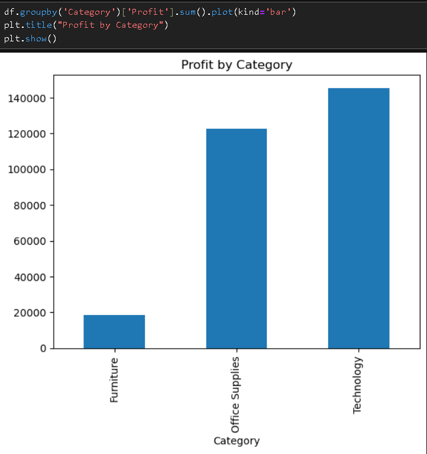
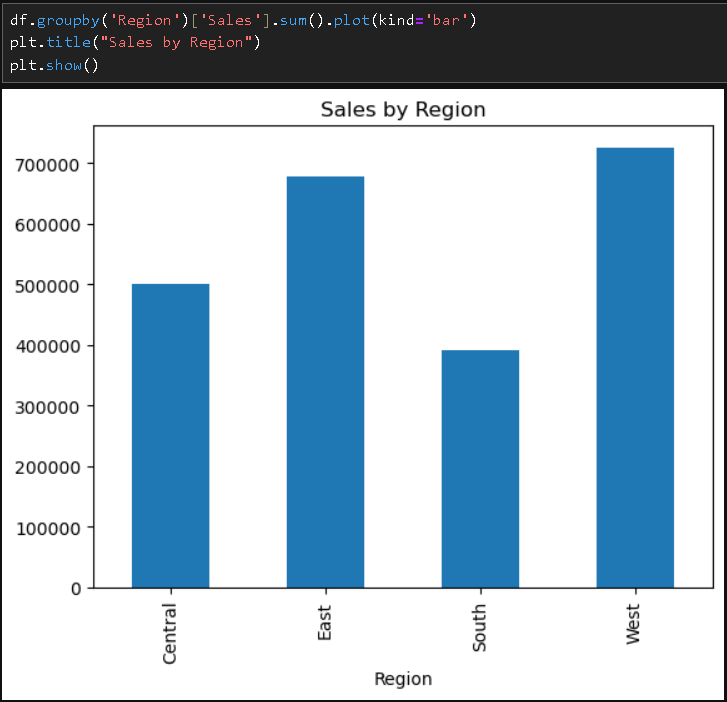
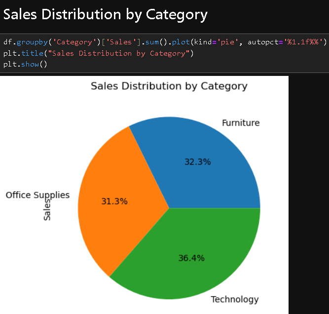

# Sales & Profit Analysis using Python

## Overview
Analyzed a retail dataset to identify sales trends and profitability using Python.
## Dataset
The dataset contains retail sales transactions including region, category, sales, and profit information.
## Problem Statement
Analyze retail sales data to identify profitable categories, regions, and areas of loss to support business decision-making.

## Visualizations
### Profit by Category

### Sales by Region

### Sales Distribution by Category

## Tools Used
- Python (Pandas, Matplotlib)
- Jupyter Notebook

## Key Insights
- Technology category generates the highest profit (~145K), indicating strong margins
- West region contributes the highest profit (~108K), showing strong regional performance
- Furniture category has the highest losses (~60K), suggesting potential inefficiencies or heavy discounting

## Project Workflow
- Data Cleaning and preprocessing
- Exploratory Data Analysis (EDA)
- Profit and Sales Analysis
- Visualization using Matplotlib
- Business Insights generation

## Files
- sales_profit_analysis.ipynb
- Superstore.csv

## Business Impact
This analysis helps businesses identify high-performing regions, optimize product strategy, and reduce losses by focusing on profitable segments.

## Conclusion
- Technology is the most profitable category
- West region contributes highest profit
- Furniture shows significant losses and needs improvement

# SQL Analysis 
Performed additional analysis using SQL on the same dataset.

### Key SQL Insights:
- Calculated total revenue using transactional data
- Identified top customers and countries by revenue
- Analyzed best-selling products
- Examined monthly revenue trends

### Files:
- `analysis.sql` → Contains all SQL queries used for analysis
